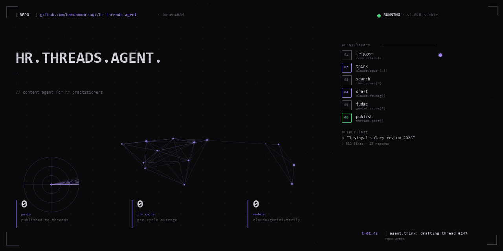

<!-- Drop this at the very top of the repo's README.md -->
<p align="center">
  
</p>

# HR Threads Agent

Autonomous content agent that publishes HR insights to Threads. Pipeline: schedule trigger → Claude thinking → Tavily web search → Claude function-calling draft → Gemini LLM-as-judge → Telegram notify → Threads publish. Running 24/7.

## Architecture

```
trigger  → claude.opus-4.8 → tavily.web(3) → claude.fc.draft() → gemini.judge → publish
```

## Stack

`Python` `Claude API` `Gemini API` `Tavily API` `Telegram Bot` `Threads API` `SQLite` `Fly.io`

## Status

🟢 **Running** — scheduled cycles, 200+ posts published.
